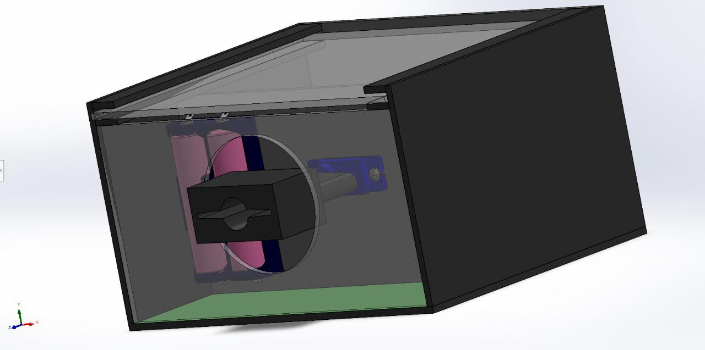

# Self-Leveling Laser System with Active Tilt Compensation

---

## 📌 Overview

Commercial **laser leveling tools** usually fail when the tilt angle exceeds **±4°**, causing inaccurate readings and unusable laser projection.

This project presents a **self-leveling laser prototype** that actively compensates large tilts using:

- **MPU6500 IMU** for real-time orientation sensing
- **Servo motor** for mechanical laser alignment
- **Bluetooth-controlled mobile application (Flutter)** to dynamically set the reference angle

The system can reliably operate even when the base is tilted beyond conventional limits, while allowing the user to define **custom reference angles**.

---

## 🎯 Key Features

- ✅ Active self-leveling beyond ±4° limitation
- 🎯 Real-time pitch estimation using **Kalman Filter**
- ⚙️ Closed-loop **PID servo control** for smooth correction
- 📱 Bluetooth angle control via **Flutter mobile app**
- 🔄 Adjustable reference angles (0°, ±45°, or any angle from −90° to +90°)
- 🚦 Visual status indication using LEDs (GREEN = level, RED = tilted)

---

## 🧠 System Concept

1. The **MPU6500** measures the pitch angle (Y-axis)
2. A **Kalman filter** fuses accelerometer and gyroscope data
3. The filtered pitch is combined with a **Bluetooth reference offset**
4. A **PID controller** drives the servo to align the laser
5. LEDs indicate whether the system is within leveling tolerance

---

## 🧩 Hardware Components

- STM32F401
- MPU6500 IMU
- Servo motor (SG90 or equivalent)
- Laser diode module
- HC-05 / HC-06 Bluetooth module
- LEDs (2× Green, 2× Red)
- Resistors & wiring

---

## 🔌 Pin Configuration

```cpp
#define LZR     PB3   // Laser Output
#define SVM     PA8   // Servo Motor

#define LED_G1  PB4
#define LED_G2  PB5
#define LED_R1  PB6
#define LED_R2  PB7

#define BT_RX   PA10  // Bluetooth RX
#define BT_TX   PA9  // Bluetooth TX
```

---

## 📐 Bluetooth Angle Control Logic

The mobile app sends angles via Bluetooth:

- **0, +45, −45** → Adjust system reference angle
- **Any angle between −90 and +90** → Dynamic offset

```cpp
BT_angle = BASE_ANGLE + mobileAngle;
```

This allows:

- Horizontal leveling (0°)
- Sloped leveling (±45°)
- Arbitrary angle projection

---

## 🎛️ Control Algorithm

### ➤ Kalman Filter

Used to estimate accurate pitch angle by fusing:

- Accelerometer (stable but noisy)
- Gyroscope (smooth but drifting)

### ➤ PID Controller

Controls the servo motor:

- **Kp = 1.2** → responsiveness
- **Ki = 0.01** → steady-state correction
- **Kd = 0.3** → damping

Includes:

- Deadband for jitter reduction
- Output saturation (0–180°)

---

## 🚦 LED Status Indication

| Condition  | LEDs        |
| ---------- | ----------- |
| Within ±5° | 🟢 Green ON |
| Beyond ±5° | 🔴 Red ON   |

---

## 📂 Project Structure

```text
README.md
src/
 ├── main.ino              # Main control logic
 ├── MPU_KF.h              # IMU interface (Kalman)
 └── MPU_KF.cpp            # IMU implementation

images/
 ├── 3d_view.jpg
 └── All Sides.jpg

videos/
 ├── structure.mp4
 ├── mobile app.mp4
 └── Real.mp4
```

---

## 🖼️ Media Showcase

### 📷 Structure Prototype
- 
- 

### 🎥 Demo Videos

- [System Structure Demo](videos/structure.mp4)
- [Mobile App Control](videos/mobile%20app.mp4)
- [Real Operation Test](videos/Real.mp4)

---

## 🚀 How to Run

1. Upload the STM32 code to the board
2. Power the system
3. Pair the Bluetooth module with your phone
4. Send angle commands from the Flutter app
5. Observe automatic laser alignment

---

## 🛠️ Future Improvements

- Dual-axis leveling (X & Y)
- OLED display for real-time angle feedback
- Auto-calibration routine
- Replace servo motor with stepper motor for higher precision

---

## 📜 License

This project is open-source and intended for **educational and prototyping purposes**.

---

## 👤 Author

**Mohammed Gharib Mohammed El-Ahmady**\
Embedded Systems & Control Enthusiast

---
